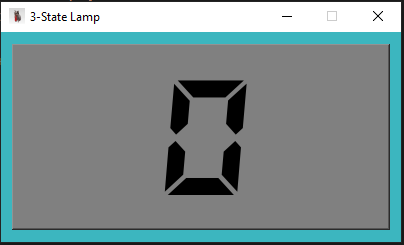
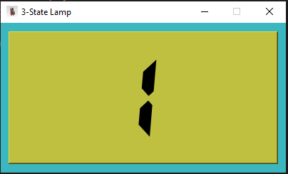
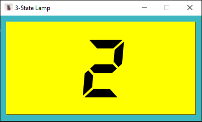

# 3-State Lamp

## About
A simple GUI application that simulates a lamp with 3 states using a button. Each button click cycles through states 0 → 1 → 2 → 0, changing background color accordingly.

## Features
- 3-state cycle using a single button
- Simple and clean GUI using PyQt5
- Beginner-friendly and easy to customize

## Requirements
- Python 3.x
- PyQt5

## How to Run
1. Clone or download this repository.
2. Make sure Python is installed.
3. Run the program:
   ```bash
   python 3-State_Lamp.py
   ```
## Screenshots



   
